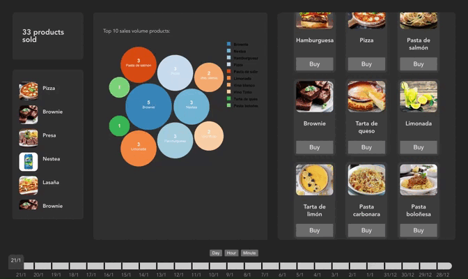

# FactorialHR JavierArocena Challenge

<!-- imagen del gif demo -->

### How to set it up

Install dependencies:

`$ npm run setup`

Launch mongodb:

`$ mongod`

Run project (frontend and backend):

`$ npm run dev`

> http://localhost:5173

Generate mock metrics:

`$ npm run mock`

---

### About the test

A nivel de arquitectura, en el Frontend he aplicado conceptos de **Clean Arquitecture** separando el dominio (/domain) de la infraestructura (/app). Los casos de uso de las métricas están encapsulados en useMetrics, desacoplados de la UI (pages y components) y del data source (MetricRepository).

### Tecnologías usadas:

Frontend:

- React
- SWR
- React-bubble-chart-d3
- React-hot-toast
- React-slider

Backend:

- Express
- Mongoose

DB:

- MongoDB
